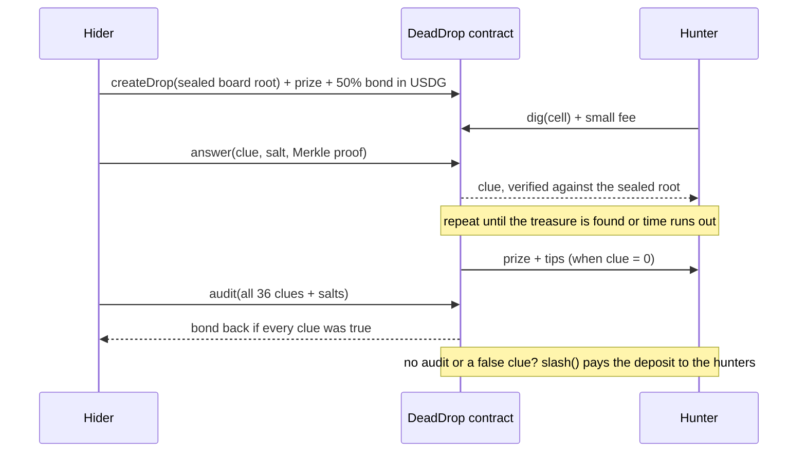

# Dead Drop

### Hide-and-seek for money, where the hider can't cheat.

Bury a USDG prize on a hidden grid. Hunters dig for it, one clue at a time. Every clue is checked on-chain against a board the hider sealed *before* the game, so nobody has to trust anybody. Built on Arbitrum for the **Arbitrum Open House Singapore Buildathon**.

| | |
|---|---|
| **Play it** | https://dead-drop-game.vercel.app/ (the **Practice round** works with no wallet) |
| **Networks** | Arbitrum Sepolia · Robinhood Chain Testnet |
| **Currency** | Paxos **USDG** (6 decimals), plus a free `tUSDG` faucet token on testnets |

---

## The idea in 20 seconds

Imagine hide-and-seek where the hider writes their hiding spot on a card and **seals it in an envelope in front of everyone**. Seekers pick a square to search and the hider says how many steps away the treasure is. The hider can't change their mind, because the envelope is already sealed. When the game ends, a robot judge **opens the envelope and checks every answer was true.** If the hider lied, or went quiet, they lose their deposit to the seekers.

That's Dead Drop. The envelope is a Merkle root, the robot judge is a smart contract, and the prize is USDG.

## Why it matters

Games with hidden information (battleship, poker, treasure hunts, fog of war) normally need a **trusted server** that knows the secret. On-chain, everything is public, so the secret has nowhere to live. Teams reach for heavy tools (zero-knowledge proofs, FHE) or give up on fairness.

Dead Drop shows a lighter way: **commit to the secret, reveal it piece by piece with proofs, and make lying cost more than it pays.** No trusted party, no ZK circuits, no off-chain game server. A good fit for Arbitrum's low fees, where many tiny interactions (one dig = one transaction) are affordable.

## How a hunt works



1. **Bury.** The hider's browser makes a random 6x6 board. Every square stores a *clue*: its distance to the treasure (0 = the treasure). Each square is hashed with a secret salt and the hashes form a Merkle tree. **Only the root goes on-chain**, with the prize and a bond.
2. **Dig.** A hunter pays a small USDG fee and picks a square. One dig at a time.
3. **Answer.** The hider (or their Autopilot) replies with the clue and a Merkle proof. The contract rejects anything that doesn't match the sealed root.
4. **Triangulate.** Each clue narrows the possible squares. The UI glows the ones still possible, so you can *see* the deduction.
5. **Win.** The first hunter to dig the treasure is paid the prize plus any tips instantly.
6. **Prove honesty.** The hider reveals the whole board. The contract rebuilds the root and checks there is **exactly one treasure and every clue is the true distance.** Pass: bond returned. Fail or vanish: anyone can call `slash()`.

## What makes cheating pointless

| Cheat attempt | What stops it |
|---|---|
| Move the treasure after seeing digs | Every answer must verify against the root sealed at creation |
| Give a false clue | Caught at `audit()`: the contract recomputes every distance. Hider is slashed |
| Seal a board with **no** treasure to farm dig fees | Audit fails and prize + bond go to the hunters. Fees are capped at prize ÷ 36, so hunters always get at least their fees back |
| Seal two treasures | `audit()` reverts with "two treasures" |
| Ignore a dig to stall | After the answer window anyone calls `claimTimeout()`: the hunter takes the prize, tips **and** the hider's bond |
| Vanish after the hunt | `slash()` is callable by anyone once the audit window passes |
| Dig your own hunt | Blocked in the contract |
| Replay a proof for another square | Each leaf commits to its cell index, clue and salt |

All of the above are covered by automated tests, including two end-to-end cheating attempts.

## USDG, end to end

Everything is denominated in **Paxos USDG**. Prizes, bonds, dig fees and tips are all USDG, and every payout is an ERC-20 transfer enforced by the contract. `scripts/deploy.js` wires in the addresses Paxos publishes and verifies on deploy that a contract exists there and reports `USDG` with 6 decimals.

| Network | USDG address |
|---|---|
| Arbitrum Sepolia | `0xFFC95faa3d63Cde504a05B567C600B78C0b41892` |
| Robinhood Chain Testnet | `0x7E955252E15c84f5768B83c41a71F9eba181802F` |
| Arbitrum One | `0x004B506865409877C9fA29bfb1ebA929984B9bbC` |
| Robinhood Chain | `0x5fc5360D0400a0Fd4f2af552ADD042D716F1d168` |

Testnet USDG is hard to get, so testnets also deploy **`tUSDG`**, a free faucet token with the same 6 decimals. Each hunt picks its token, so real USDG and tUSDG hunts live side by side.

## Deployed contracts

| Network | Contract | Address |
|---|---|---|
| Arbitrum Sepolia | **DeadDrop** | [`0xfCD6dcA15B508eae465fd967ba3f78530D813bd0`](https://sepolia.arbiscan.io/address/0xfCD6dcA15B508eae465fd967ba3f78530D813bd0) |
| Arbitrum Sepolia | tUSDG (test faucet) | [`0xb427093fCF9BE1e0cE13A99250aa07fB11C6D271`](https://sepolia.arbiscan.io/address/0xb427093fCF9BE1e0cE13A99250aa07fB11C6D271) |
| Robinhood Chain Testnet | **DeadDrop** | [`0x6d8B79746721375EdA021D6A523105878c9e52f5`](https://explorer.testnet.chain.robinhood.com/address/0x6d8B79746721375EdA021D6A523105878c9e52f5) |
| Robinhood Chain Testnet | tUSDG (test faucet) | [`0x25Cc3848b2f6fd0Fc7D180BfF67274d56775b39f`](https://explorer.testnet.chain.robinhood.com/address/0x25Cc3848b2f6fd0Fc7D180BfF67274d56775b39f) |

## Try it

**Fastest (no wallet):** open the app and press **Try a practice round**. Same board, same deduction, no money.

**Play for real on a testnet:**
1. Add Arbitrum Sepolia or Robinhood Chain Testnet to your wallet and get testnet ETH ([Robinhood faucet](https://faucet.testnet.chain.robinhood.com/)).
2. Connect, press **Get 1,000 tUSDG**.
3. **As a hunter:** open a hunt, click a square, press Dig. Glowing squares are the only spots still possible.
4. **As a hider:** press **Bury a treasure**. Leave **Autopilot** on: it creates a throwaway key that can *only* answer digs for this hunt, so you never click a wallet pop-up per dig. Keep the tab open (or run the keeper bot below). Your tab also audits the board automatically at the end.

> A live hunt needs its hider online to answer digs. If a hider is offline, hunters can claim everything after the answer window. That is the game working as designed. Use the Practice round for an instant demo.

## Run it yourself

Needs Node.js 20+, a wallet, and a throwaway key funded with testnet ETH.

```bash
npm install
npm test                       # 11 passing
cp .env.example .env           # add PRIVATE_KEY (throwaway!) and optional RPC URLs
npm run deploy:sepolia         # and/or: npm run deploy:robinhood-testnet
cd frontend && npm install && npm run dev      # http://localhost:5173
```

`deploy` writes the addresses to `frontend/src/deployments.json`, which the UI reads.

**Deploy the UI to Vercel:** import the repo, set **Root Directory** to `frontend`, framework **Vite** (build `npm run build`, output `dist`). Optional env vars `VITE_RPC_421614` and `VITE_RPC_46630` make the app read through your own RPC (for example Alchemy). Those values are public in the browser bundle, so restrict the key to your domain.

**Keeper bot (hands-free hiding):**
```bash
npm run keeper -- --drop 3 --board dead-drop-board-xxxx.json
```
Answers digs, closes the hunt and audits while you're offline. Use the board backup the UI downloads.

## Architecture

```
contracts/DeadDrop.sol     game logic: create, tip, dig, answer, claimTimeout, expire, audit, slash
contracts/MockUSDG.sol     faucet token for testnets only
test/DeadDrop.test.js      11 tests incl. cheating attempts
scripts/deploy.js          deploys with real Paxos USDG + tUSDG, writes frontend config
scripts/keeper.mjs         optional bot that answers digs and audits
frontend/                  React + Vite game UI
  src/lib/board.mjs        board, Merkle tree and proofs (shared by UI, keeper and tests)
```

**Contract details.** 6x6 grid, 64-leaf Merkle tree (36 cells + 28 zero pads), leaf = `keccak256(abi.encode(cell, clue, salt))`, commutative pair hashing (OpenZeppelin `MerkleProof`). Bond is 50% of the prize. Fee ≤ prize ÷ 36. One pending dig per hunt. Reentrancy-guarded; payments via `SafeERC20`.

## Sponsor and partner tech

| Technology | How it's used |
|---|---|
| **Paxos USDG** | The game's currency: prizes, bonds, fees, tips |
| **Robinhood Chain** | Deployed and playable on Robinhood Chain Testnet |
| **OpenZeppelin** | `MerkleProof`, `SafeERC20`, `ReentrancyGuard`, `ERC20` |
| **Alchemy** | RPC for deployments and (when configured) the app's reads |

## Honest limitations

- **Unaudited prototype, testnet only.** Don't use real funds.
- **Liveness is part of the design.** A hider who can't answer in time forfeits. Autopilot works while the tab is open; the keeper bot covers the rest. Lose the board backup and you can't answer or audit.
- **Tips can be gamed.** A hider using a second wallet can find their own treasure and keep tips. Treat tips as donations.
- **Cheat-deterrence assumes independent hunters.** A hider who digs with their own other wallets only moves money between themselves.
- **Dig order is first-come.** Arbitrum's sequencer has no public mempool, which makes copying a dig hard, but this hasn't been tested adversarially.
- **USDG is a regulated token.** Paxos can pause it or block an address; a blocked winner's payout would revert.
- **Tested** with contract tests, a local end-to-end run of the keeper bot, and a two-player browser run on a local chain. Live-network runs are manual.

## Roadmap

- Bigger boards and multiple treasures, with a Merkle-subset audit
- Tournaments and leaderboards across hunts
- Session keys / account abstraction so Autopilot needs no funded throwaway key
- Mainnet launch on Arbitrum One after an audit
- Hunts as shareable links for social play

## Built by

James Wasonga, for the Arbitrum Open House Singapore Buildathon. Everything here was written during the Buildathon.

License: MIT